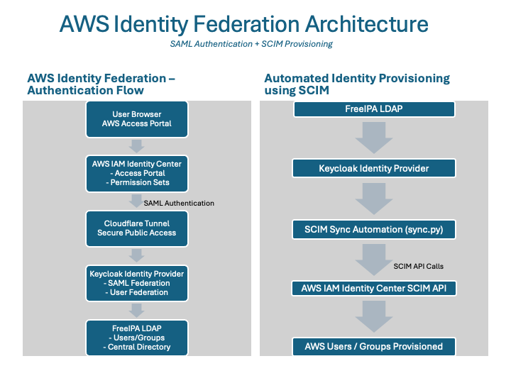
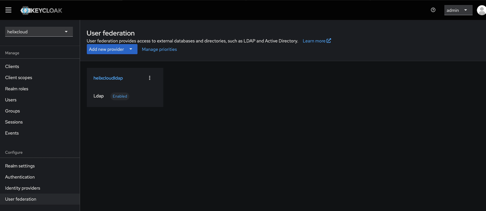
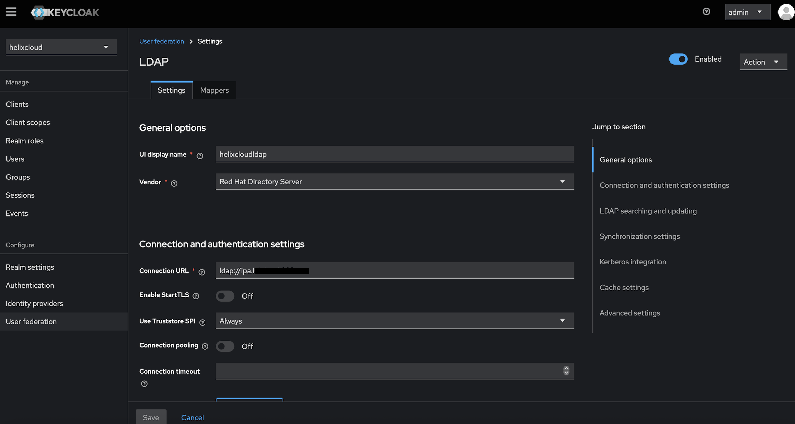
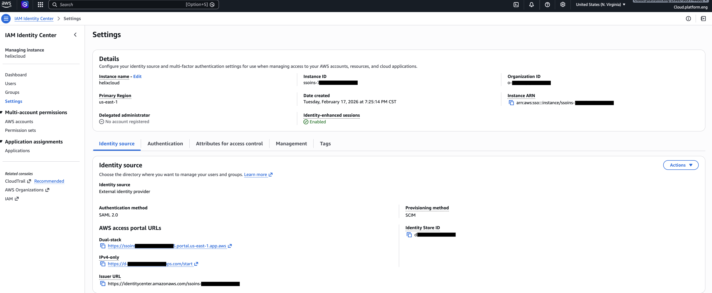
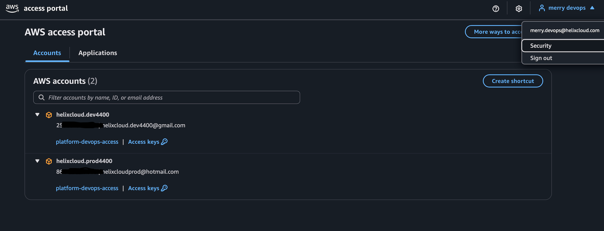

# **aws-keycloak-identity-federation**

This project demonstrates federated authentication between AWS IAM Identity Center and Keycloak using SAML 2.0, with automated identity provisioning via the AWS SCIM API. The architecture integrates AWS IAM Identity Center, Keycloak, and FreeIPA LDAP to provide centralized authentication and automated user lifecycle management.
---

## Architecture

### Authentication (SAML)
Users authenticate through Keycloak, which acts as the Identity Provider (IdP) for AWS IAM Identity Center.
Flow: User → AWS Access Portal → AWS IAM Identity Center → Keycloak → FreeIPA LDAP

### Identity Provisioning (SCIM)
User/group provisioning into AWS Identity Center is automated using the SCIM API.
Flow: FreeIPA LDAP → Keycloak → SCIM Sync Script → AWS SCIM API → AWS Identity Center.
---

## Technologies Involved
- **AWS IAM Identity Center** – centralized AWS access management
- **Keycloak** – SAML identity provider
- **FreeIPA LDAP** – enterprise directory for users/groups
- **Cloudflare Tunnel** – secure external access to Keycloak
- **SAML 2.0** - Security Assertion Markup Language is a standards-based protocol for exchanging digital authentication signatures.
- **SCIM API** - protocol supports the automatic exchange of user identity information across different systems, typically between identity providers (IdPs) and service providers (SPs)
- **Automation Module (Python)** - logs in to Keycloak using a service account, reads groups and group members, connects to AWS IAM SCIM API, checks whether those users and groups already exist in AWS, creates them if they do not exist & updates group membership in AWS so it matches Keycloak
---

## Keycloak Configuration
Keycloak is configured as the SAML Identity Provider for AWS IAM Identity Center.
Screenshots of configuration:
 

---

## AWS IAM Identity Center Configuration
AWS IAM Identity Center is configured with:
- External Identity Provider
- SAML 2.0 authentication
- SCIM provisioning - Enable Auto-Provisioning
Example configuration:

## **Users authenticate through the **AWS Access Portal**.

---

## SCIM Automation
User provisioning is automated using a Python script that interacts with the AWS SCIM API.
Directory:
scim-sync/
Files:
sync.py
env.sh
---

